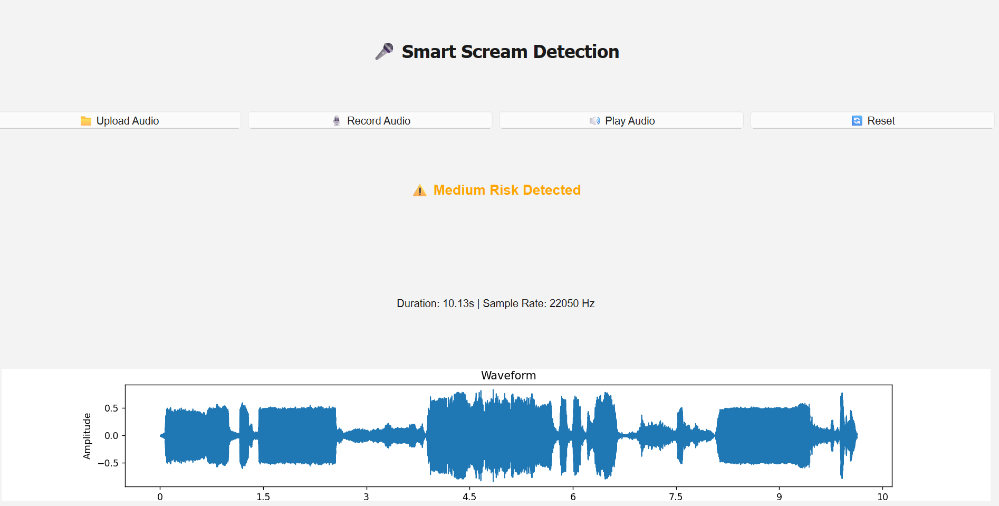

ScreamGuard - Smart Scream Detection System

Overview

ScreamGuard is an audio analysis tool designed to detect scream sounds in audio recordings using machine learning. It helps identify potential distress or emergency situations by classifying audio inputs into risk levels.

Features

Upload or record audio for scream detection

Visual waveform display of audio input

Real-time playback of audio

Risk level classification (High, Medium, Safe)

User-friendly GUI built with PyQt6

Splash screen with welcoming message and branding

Installation
Clone this repository

bash
Copy code
git clone https://github.com/KushiHarish/scream_guard_project.git
cd scream_guard_project

Create and activate a virtual environment

Copy code
python -m venv venv
source venv/bin/activate # On Windows: venv\Scripts\activate
Install dependencies

Copy code
pip install -r requirements.txt

Usage
Run the welcome screen (which transitions to the main interface automatically):

Copy code
python -m gui.welcome_screen
Or directly launch the main interface:

Copy code
python -m gui.main_interface
Dependencies
Python 3.10+

PyQt6

librosa

matplotlib

pygame

Other dependencies listed in requirements.txt

Project Structure
bash
Copy code
scream_guard_project/
├── gui/ # GUI modules including welcome screen and main interface  
├── utils/ # Utility scripts like microphone recorder  
├── predict.py # Audio prediction module  
├── requirements.txt # Python dependencies  
├── README.md # Project documentation  
└── ...  
Contribution
Contributions are welcome! Feel free to open issues or submit pull requests.

License
Specify your license here (e.g., MIT License).

the
Contact
Developer-1
Kushi L H- kushiharish1235@gmail.com
Project Link: https://github.com/KushiHarish/scream_guard_project

Developer-2
Lekhana Bhat - bhatlekhana2004@gmail.com
also find in : Lekhana-bhat-2004/github.com

## 📊 Sample Output

Here's a sample output of the scream detection system:

